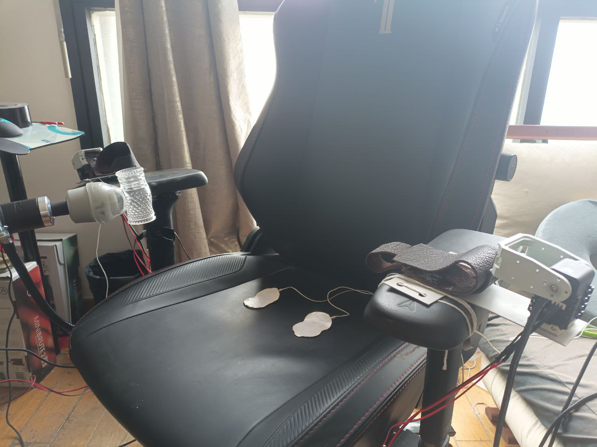
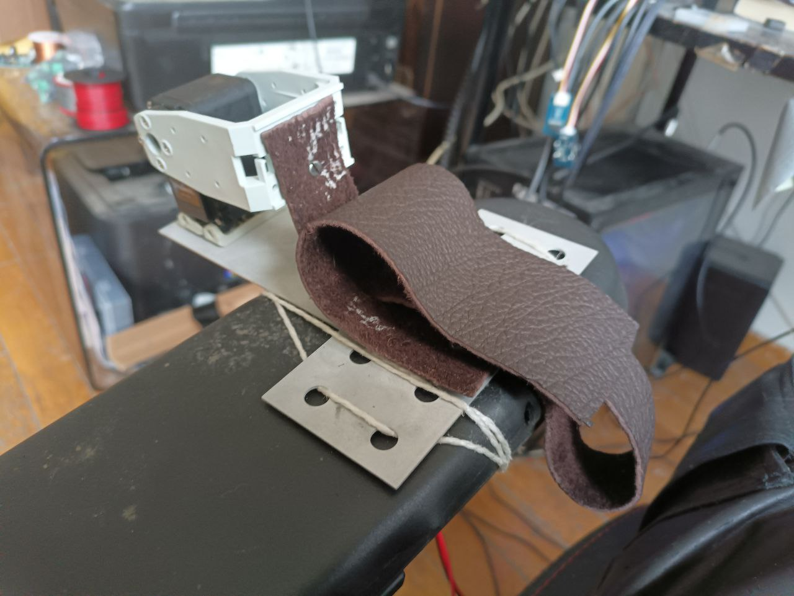
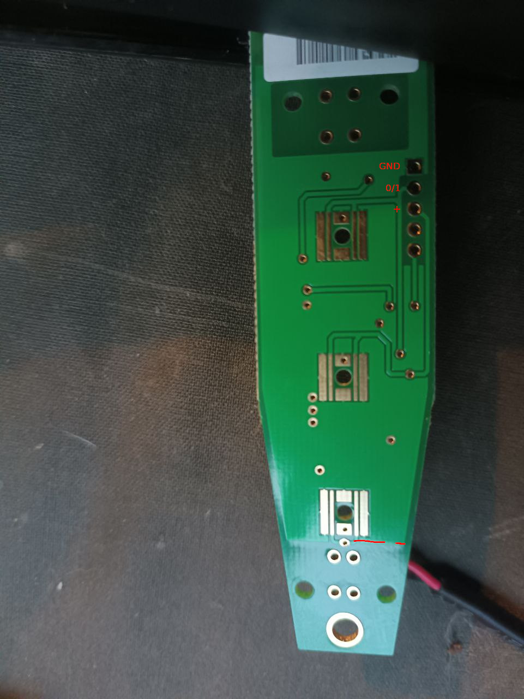

# The Chair

## What is it?

Enhanced chair with cuffs on the armrest, a magic wand, and an estim box,
all controlled locally by the computer, or remotely through a JITSI chat.

## Safety first

Do not use the cuffs if you are alone, a lot of things can go wrong!

## Hardware

### Cuffs

#### Bill of materials

- Two dynamixel AX-12A motors and provided screws and base plate
- Two long AX-12 (bioloid) frames: https://www.robotis.us/fp04-f4-6pcs/
- Probably long dynamixel 3-wire cables, you might need to solder one yourself
- A usb2dynamixel, robotis or other brand
- A dynamixel power module. You can make your own by using a 12V power supply: just
cut a dynamixel cable and wire VCC and GND to your power supply.
- Metal frames to hold the cuff and motor. Schematics [here](schematics/)
- 2-3mm thick leather sheet. Cut the cuffs according to the schema in schmeatics/
- Screws and rivets.

#### Assembly

Note that the code that controls the motors is pretty dumb: open is 90 degres clockwise,
and close is 90 degres counterclockwise, so make sure to length the leather strip
correctly so that it doesn't overtighten.

### Magic wand

#### Bill of materials:

- A doxy magic wand
- A soldering iron and wiring
- A relay card: sainsmart 4 relay USB card
- A 5V power supply for the relay card

#### Assembly:

Remove the screws from the wand and open it.
Solder 4 wires to the circuit according to the schema below:

If you have trouble with the "-" wire, you can alternatively solder it to the IC
pin the marked hole connects to.

Then connect the wires to 3 relays replicating GND: GND 0/1, GND +, and GND -

### E-STIM

That part is easy, you just need an ET-312 box, and an USB to RS232 jack to connect it.

## Software

The control software is written in python, and contains three parts.

"chair.py" is the base module. You can run it directly to have command line controls (commands described below):

    python3 chair.py wand_serial estim_serial dynamixel_serial

For each serial port you can use "fake" to start without any real hardware connected.
Otherwise use '0' for wand_serial (uses libusb to locate it), and the appropriate
com port for the other two (/dev/ttyUSBX or /dev/ttyACMX on linux, COMX on windows).

"chair-solo.py" is an automatic control of the chair. Edit the script to tune its parameters.

"chair-jitsi.py" provides controls of the chair through a JITSI chat. Prefix all
commands with a bang("!").

## Software commands

- help: list available commands
- e help: more detailed estim commands
- e lock 1 or e lock 0: lock front pannel. You need it locked to control level and ma knobs
- e m MODE: switch mode to given
- e a VALUE or e b VALUE: set channel intensity from 0 to 255.
- e speed VALUE: set mode adjust knob from 0 to 100
- c close: close cuffs
- c open: open cuffs
- w on|off : turn wand on or off
- w <LEVEL>: set wand intensity to given level
- w + or w -: increase/decrease level (you can use multilpe + or -)